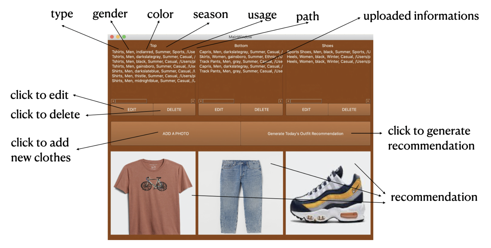
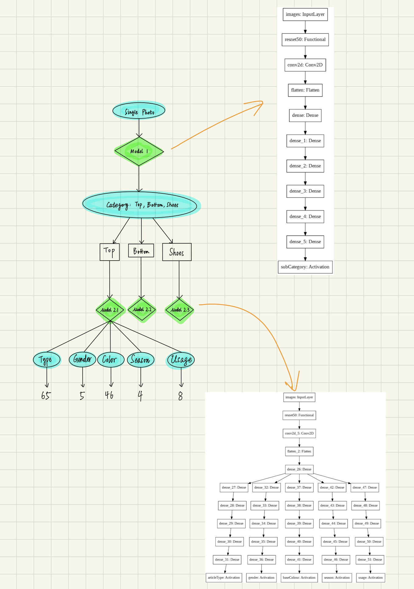
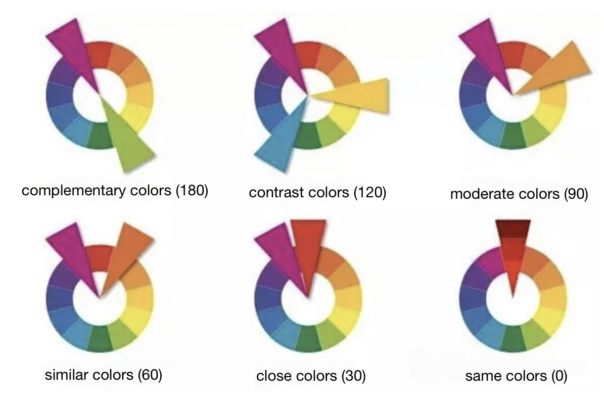

In general, we have implemented such a local app which can store photo of clothes owned by users and recommend what to wear (top, bottom, and shoes) today.

<br>
1) In this app, users can choose to add a photo from their own computer (we need users to take a photo of their own clothes and store it in the computer) to our app. In the process of adding pictures, this picture will be automatically recognized by our pre-trained model at one time, by type (such as T-shirt), gender (such as women), color (such as navy blue), season (such as summer), usage (such as formal, casual, sport, etc.), and path of the photo. These six types of information will be stored in the app and displayed for the user's reference. Considering that our model is sometimes inaccurate, and in order to facilitate user operations, we also provide users with editing and deleting buttons. Therefore, the user can edit the information we misidentified or delete a piece of clothing.

We provide users with a "Generate Today's Outfit Recommendations" button, which can provide users with recommendations. The recommended result is composed of three pictures, namely top, bottom, and shoes. Of course, these three pictures are the user's own clothes.

Below is a functional diagram of using our app:



<br>
2) Behind such an app, we have four neural network models and a recommendation system.

For our neural network models: The first model (with accuracy over 99%) is used to identify whether the clothes are tops or bottoms or shoes. After this, the photo will be directed to one of the other three models based on the results of the first model (please see the picture below). These three similar but not exactly the same models (with overall accuracy around 80% ) will identify type(65), gender(5), color(46), season(4), and usage(8).

Below is a flow chart of our recognition process:



<br>
3) For the recommendation process: 
The program randomly selects a top, and we look for the same gender, the same season, and the same usage in the bottoms and shoes stored in the app. After this, we recommend outfits based on the color. Our recommended method for color is based on such a color wheel. We summarized the 46 colors in the data set into 12 colors in the figure, plus three colors of black, white, gray, and multi-color, recommending according to the angle between the colors.



<br>
4) To start the app: 

a) First download ui_module.py, recognition_module.py, and models from this repo to the same folder. 

b) Next type the following code in any Python environment:
```
   from ui_module import*
   run_ui()    
```   

c) Then you will see the app!
